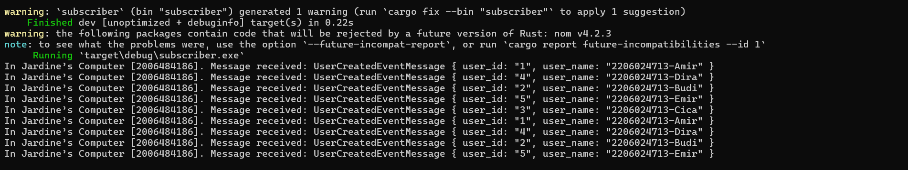
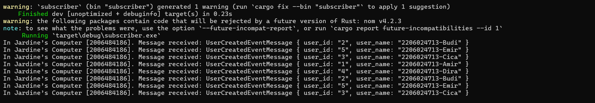
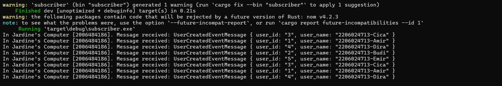

## REFLECTION
1. **what is amqp?**
>
2. **what it means? guest:guest@localhost:5672, what is the first guest, and what is the second guest, and what is localhost:5672 is for?**
>
 

### **Screenshot of RabbitMQ, simulating a slow subscriber.**
> Total number of queues went up to twenty, after running cargo run the publisher console five times (sending five messages per run). Hence, twenty messages in queue.   
   

### **Running three subscriber console instances.**
> Console 1.   
   
> Console 2.   
   
> Console 3.   
   

### **Screenshot of RabbitMQ spike reduced because of the extra instances taking up the requests in the queues.**
   

> One improvement that could be proposed is to replace "unwrap()" for errors. While it is quick and useful in some cases, it is only meant to be a placeholder. It provides zero information for error-handling and simply just crashes the program, which could be problematic. Better implementation would be using "match" which gives us more explicit control on error-handling and avoids panic!s if it is not needed.